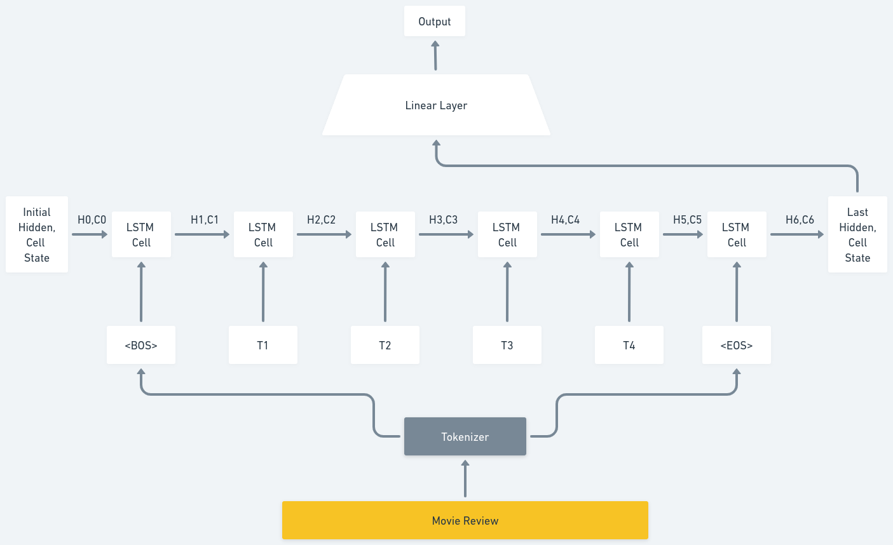

|Version Info| [](https://www.python.org/downloads/release/python-3913/)  [](https://releases.ubuntu.com/20.04/) [](https://releases.ubuntu.com/20.04/) 
|----|----|
# IMDBSentimentClassification
Sentiment Classification on IMDB Dataset Using LSTM and RNN



### Install Requirements
```bash
pip install -r requirements.txt
```

### For Training
```bash
python train.py
```


